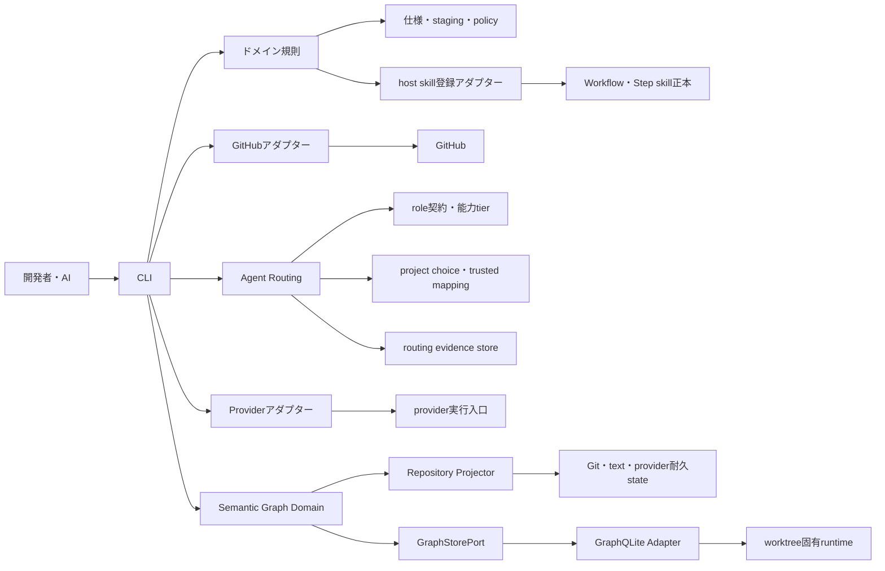

# システム構造

## 境界づけられたコンテキスト

- 計画: モード判定、一時ステージング、構造検証、耐久トラッカーへの同期。
- 仕様: 新規プロジェクトへの仕様生成と仕様整合性。
- レビュー: 有限な肯定・敵対評価と、停止対象指摘の収束。
- Agent Routing: scopeごとのrole、provider、model、実行設定、identity独立性を決定的に解決し、実装開始前と終了時の証拠を拘束する。
- Role Policy: 6 roleの許可path・操作・必要証拠、implementerとreviewerのidentity・context独立性、risk比例のmodel tier、provider別自律選択上限を純関数で検証する。
- worktreeライフサイクル: 隔離作成、検査、復旧、完了処理。
- 提出: PRでの既定停止と、信頼済みポリシーによるマージ承認。
- パッケージライフサイクル: 所有権を保持する初期導入、更新、診断、アンインストール。
- Host Integration: 1つの`asc-step`正本をClaude CodeとCodexの探索pathへ写し、Workflow・Step skill正本へ一方向に誘導する。
- Graph Projection: Git・text・provider耐久stateの意味をworktree固有の破棄可能なSemantic Graphへ決定論的に投影し、drift制御付きの影響・依存・説明経路探索を提供する。

## 依存方向

`src/domain`が不変条件を所有し、`src/cli.ts`がそれらを合成する。Agent Routingでは`src/cli.ts`がproject choiceとtrusted provider capability mappingを読み、`src/adapters/provider.ts`のread-only観測を`src/domain/routing.ts`へ値として渡す。resolverと独立性validatorはprovider adapterへ依存せず、外部観測からdomainへの逆依存を認めない。routing evidenceは解決結果から実装差分への上流証拠とし、completion recordとreview判定からrouting decisionへ戻る依存を認めない。

`src/domain/role.ts`は外部処理を持たず、role assignment、role operation、必要tier、model mapping、provider上限と人間overrideを検証する。能力tierの結果は既存enforcementへauthorityを追加せず、filesystem、GitHub、merge、releaseの操作権限は各信頼境界が独立して判定する。project choiceのrole contract・tier mapping・risk別最低tierはoptionalな前方互換入力とし、固定choiceへの適用はvalidatorがtrusted baseになった後の別PRで行う。

`src/adapters/github.ts`はGitHub外部プロセス、`src/adapters/provider.ts`はprovider実行入口との境界である。project固有のprovider能力と公式選択元は`.agent-skill-chain/project/providers/`、role別の論理選択と保持方針は`.agent-skill-chain/project/choices/`が所有する。具体的model slugは永続mappingに置かず、Codex公式`model/list`のpicker-visible一覧、recommended default、対応reasoning effortから実行時に解決する。ファイルシステム、外部プロセス、原子的書き込み、安全検査の共通部品は`src/lib`に置く。スキルは契約だけを持ち、外部CLIを直接呼ばない。

Semantic GraphではDomainの型・決定論的bounded BFS・Kahn法・iterative Tarjan法・BFS/Dijkstraが`GraphStorePort`へだけ依存する。Repository Projectorが正本sourceをcanonical snapshotへ変換し、GraphQLite v0.6.1は`src/adapters`側のstorageと固定parameterized queryだけを担う。GraphQLite固有import・SQL・CypherをDomainへ逆依存させず、任意Cypher APIを公開しない。
`src/adapters/github.ts`はGitHub外部プロセス、`src/adapters/provider.ts`はprovider実行入口との境界である。project固有のprovider能力と公式選択元は`.agent-skill-chain/project/providers/`、role別の論理選択と保持方針は`.agent-skill-chain/project/choices/`が所有する。具体的model slugは永続mappingに置かず、Codex公式`model/list`のpicker-visible一覧、recommended default、対応reasoning effortから実行時に解決する。ファイルシステム、外部プロセス、原子的書き込み、安全検査の共通部品は`src/lib`に置く。`.agent-skill-chain/skills/asc-step/SKILL.md`をhost adapterの唯一のpackage正本とし、lifecycle domainが`.claude/skills/asc-step/SKILL.md`と`.agents/skills/asc-step/SKILL.md`へのmapping、hash、所有権を管理する。スキルは契約だけを持ち、外部CLIを直接呼ばない。

## 信頼境界と原子性

入力を制限してからファイルシステム上のパスを解決する。複数ファイルのステージングは非公開の隣接ディレクトリへ書き、原子的に名前変更する。外部書き込みは事前確認と適用を分離する。マージ時は候補ブランチではなく`origin/<default>`からポリシーを読み、PRのSHAを再検証する。完了処理は完全な報告をハッシュ化し、削除直前に再検査する。

Graph投影は`.agent-skill-chain/runtime/graph/v1/`内の非公開な新generationに完全構築し、manifest・実Graph・source identityの再読取一致後だけcurrent pointerを原子的に切り替える。driftまたは不完全な投影はexact Graph Evidenceに使用しない。

## ロールバック

実装ブランチは、旧資産を意図的に削除した基点を含む。v0.3資産のコミットを戻すと旧ハーネスを復元せず、その削除済み状態へ戻る。利用側所有の一時ステージング、仕様、ポリシーはパッケージ所有外なので保持する。
