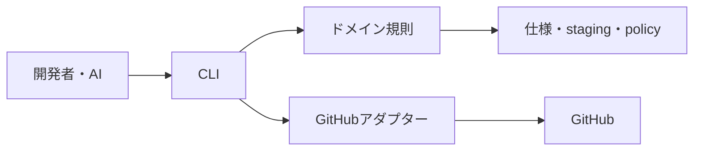

# システム構造

## 境界づけられたコンテキスト

- 計画: モード判定、一時ステージング、構造検証、耐久トラッカーへの同期。
- 仕様: 新規プロジェクトへの仕様生成と仕様整合性。
- レビュー: 有限な肯定・敵対評価と、停止対象指摘の収束。
- worktreeライフサイクル: 隔離作成、検査、復旧、完了処理。
- 提出: PRでの既定停止と、信頼済みポリシーによるマージ承認。
- パッケージライフサイクル: 所有権を保持する初期導入、更新、診断、アンインストール。

## 依存方向

`src/domain`が不変条件を所有し、`src/cli.js`がそれらを合成する。`src/adapters/github.js`はGitHub外部プロセスとの唯一の境界である。ファイルシステム、外部プロセス、原子的書き込み、安全検査の共通部品は`src/lib`に置く。スキルは契約だけを持ち、`gh`を直接呼ばない。

## 信頼境界と原子性

入力を制限してからファイルシステム上のパスを解決する。複数ファイルのステージングは非公開の隣接ディレクトリへ書き、原子的に名前変更する。外部書き込みは事前確認と適用を分離する。マージ時は候補ブランチではなく`origin/<default>`からポリシーを読み、PRのSHAを再検証する。完了処理は完全な報告をハッシュ化し、削除直前に再検査する。

## ロールバック

実装ブランチは、旧資産を意図的に削除した基点を含む。v0.3資産のコミットを戻すと旧ハーネスを復元せず、その削除済み状態へ戻る。利用側所有の一時ステージング、仕様、ポリシーはパッケージ所有外なので保持する。
