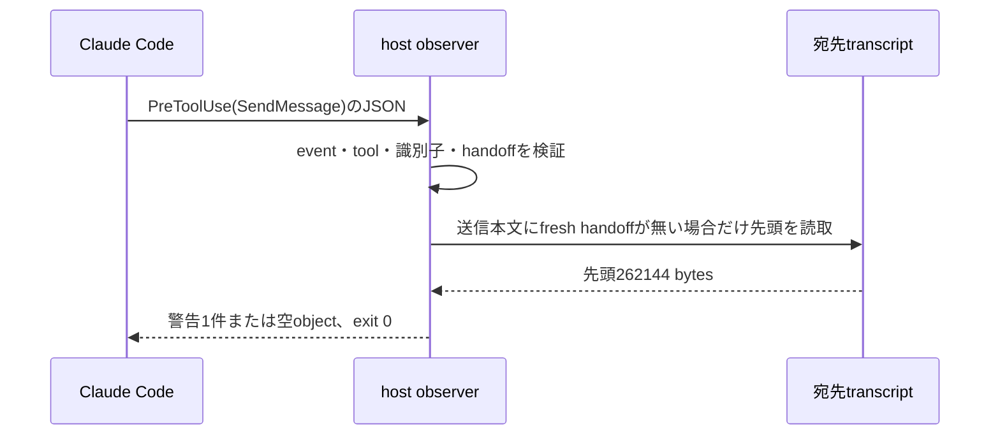

# HOOK-001 ホスト観測契約

- 目的: Claude Codeの`PreToolUse`（tool `SendMessage`）で、fresh contextを要するWork Unitの既存agentへの送信（fresh mismatch）と、terminal済みWork Unitを担当したagentへの追加作業（terminal reuse）をadvisory警告として知らせる（REQ-LC-1566）。
- 呼出元・呼出先: Claude Code（host）→ `.claude/hooks/asc-host-observer.mjs`（正本は`.agent-skill-chain/hooks/asc-host-observer.mjs`）。
- 契約版: 検証済みhostはClaude Code 2.1.282だけである。observerはhost versionで分岐しない。
- 認証・認可: hookの起動可否はClaude Codeのworkspace trustに従う。ASCは承認を追加・偽装しない。
- 冪等性: 同じ入力と同じtranscriptに対して常に同じ出力を返す。fileを書かず、状態を持たない。
- 権限: 出力はadvisoryであり、workflow・review・deliveryのどの判定にも入らない。toolの許可・拒否・保留を表すkey（`permissionDecision`・`decision`・`continue`・`stopReason`）を出力しない。

## 登録

`install --apply`・`update --apply`は`.claude/settings.local.json`の`hooks.PreToolUse`へ次のASC-owned entryを1件だけ置く。shellを介さない形式であり、hostは`args`の`${CLAUDE_PROJECT_DIR}`を置換して`node`を直接起動する。

```json
{
  "matcher": "SendMessage",
  "hooks": [
    {
      "type": "command",
      "command": "node",
      "args": ["${CLAUDE_PROJECT_DIR}/.claude/hooks/asc-host-observer.mjs"],
      "timeout": 10
    }
  ]
}
```

- 所有判定は`type`が`command`、`command`が`node`、`args`が長さ1で先頭要素が上記pathと完全一致するhookだけである。`timeout`・matcher・追加fieldは所有を移さない。path部分一致やwrapperの推測で利用者のhookを奪わない。
- install・updateは全event・全groupから所有hookを数え、上記の正規形が1件だけならそのまま保つ。それ以外（0件・重複・他event・他matcher・同group同居・改変）は所有hookをすべて除き、空になったgroup・eventを削除し、`hooks.PreToolUse`の末尾へ正規形groupを1個加える。利用者のhook・permissions・env・同groupの他commandは位置も内容も変えない。
- `delete --apply`は所有hookをすべて除き、正規形を加えない。fileは利用者所有のため削除せず、残りが無ければ`{}`にする。
- 他のevent・toolには登録しない。Bash・Edit・Agent等の呼出しではobserverのprocessは起動しない。
- 登録は新しいClaude Code sessionから有効になる。無効化は`delete --apply`または所有entryの手動削除で行い、observerが残す状態は無い。

## 入力

| 項目 | 位置 | 型 | 必須 | 制約 | 秘密区分 |
|---|---|---|---|---|---|
| `hook_event_name` | stdin JSON | 文字列 | 必須 | `PreToolUse`と完全一致 | 公開 |
| `tool_name` | stdin JSON | 文字列 | 必須 | `SendMessage`と完全一致 | 公開 |
| `session_id` | stdin JSON | 文字列 | 必須 | `^[A-Za-z0-9_-]{1,128}$`。正規化しない | 内部 |
| `tool_input.to` | stdin JSON | 文字列 | 必須 | 宛先agentの`agent_id`。`session_id`と同じ形式 | 内部 |
| `tool_input.message` | stdin JSON | 文字列 | 任意 | 文字列でなければ`tool_input.content`を読む。本文は出力しない | 機密 |
| `transcript_path` | stdin JSON | 文字列 | terminal判定時だけ必須 | 絶対path、NULを含まない。directory部分だけを使う | 内部 |
| 宛先subagent transcript | `<dirname(transcript_path)>/<session_id>/subagents/agent-<to>.jsonl` | JSONL | 任意 | 通常fileだけ（symlink不可）。先頭262144 bytesだけを読取専用で読む | 機密 |

- stdinの上限は8 MiBであり、超過した入力は判定せず`{}`を返す。
- ASC handoffは`kind`が`asc-handoff/v1`、`workUnit.workUnitId`が小文字16進64桁、`workUnit.freshContextRequired`と`workUnit.terminalAfterHandback`が真偽値、の4条件をすべて満たすobjectだけを認める。本文やtranscriptの行に埋め込まれたJSONは、引用符を考慮した括弧対応で候補を切り出して解析する（候補は1文字列あたり64回、入れ子の文字列は4段、object走査は深さ16・10000 nodeまで）。
- `workUnitId`とhostの`agent_id`は比較しない。識別子からpathを組み立てるのは形式検証の後だけである。

## 出力

| 結果 | 状態・終了値 | 応答 | 再試行 | 副作用 |
|---|---|---|---|---|
| fresh mismatch | exit 0 | `systemMessage`と`hookSpecificOutput.additionalContext`へ下記の文言1、contextへは`workUnitId`と`agentId`を付記 | 不要 | 変更しない |
| terminal reuse | exit 0 | 同上で下記の文言2。`workUnitId`はtranscript内のhandoffから取る | 不要 | 変更しない |
| 対象外・判別不能・内部例外 | exit 0 | `{}` | 不要 | 変更しない |

1. `ASC WARN: This Work Unit requires a fresh execution context. The observed Claude Code agent identity is being reused. Redispatch a fresh worker.`
2. `ASC WARN: This agent completed a terminal ASC Work Unit. Do not continue ASC work in this context. Run workflow advance and dispatch a fresh worker.`

- 送信本文にfresh handoffがあればfresh mismatchを返し、無い場合だけ宛先transcriptの先頭を読む。警告は1回の起動で高々1件である。
- stdoutへの書込は1行のJSONを1回だけ行い、stderrへは書かない。終了は`process.exitCode`で表し、待機APIを使わない。
- 対象外にはevent・tool違い、malformed JSON、空入力、object以外、必須field欠落、識別子形式外、transcriptの欠落・symlink・directory・読取失敗・先頭262144 bytes外、未検証のhost versionを含む。



## 失敗時の振る舞い

| 失敗 | 利用者への結果 | 復旧 |
|---|---|---|
| 入力不正・対象外・transcript欠落 | 何も表示されずtoolは実行される | 不要 |
| observer内部の例外 | `{}`・exit 0 | 不要 |
| entryはあるが資産が欠落、`node`がPATHに無い、未検証versionが`args`を解釈しない、timeout超過 | hostがnon-blocking hook errorを表示し、toolは実行される | `update --apply`で資産を再配置する。または`delete --apply`・entry削除で無効化する |
| 偽のhandoffによる誤警告 | advisory文言1件 | 無視するか、fresh workerへ出し直す |

- 判定はClaude Code 2.1.282の未文書化の挙動（`SendMessage`の`to`がagent_idであること、transcriptの配置）に依存する。hostの変更で判別できなくなった場合は無警告へ倒れ、toolを止めない。
- terminal reuseは宛先transcript先頭の`terminalAfterHandback: true`だけで判定するため、実行中（未返却）のterminal Work Unitへの同じWork Unitの途中指示にも警告が出る。区別に必要な台帳・完了記録は持たない。

## 移植性

- observerはNode.js標準moduleの`node:fs`・`node:path`・`node:process`だけを使い、shell・外部command・固定temp path・POSIX区切りに依存しない。pathは`path.join`・`path.dirname`・`path.isAbsolute`だけで扱う。
- `.github/workflows/host-observer-portability.yml`がubuntu-latest・macos-latest・windows-latestのNode.js 24で`node --test test/host-observer/portable.test.mjs`を実行する。
- Windows・macOSでのhostによる起動そのものは未実測である。公式hook reference（https://code.claude.com/docs/en/hooks.md 、2026-10-07確認）は`args`がある場合にshellを介さず`command`を直接起動すること、placeholderを各`args`要素へ置換すること、Windowsでは`node`と`args`で直接起動する形を記載しており、本契約の登録はその形と同じである。

## Capability Probeの観測（Claude Code 2.1.282）

- 方法: 隔離したscratch Git projectへ観測専用のprobe hookを19 eventに登録し、`claude -p`をheadlessで起動した。probeはstdoutへ何も書かず常にexit 0で、本文を保存せずkey名・識別子・短い安全fieldだけを記録した。
- 記録: `test/fixtures/host-observer/claude-code-2.1.282/`の3 file（106 event）。各eventへ`tool_input`のkey名と型（値なし）を`toolInputShape`として保持し、絶対pathは`<PROJECT>`・`<CLAUDE_PROJECT_STORE>`・`<HOME>`へ置換済みで環境変数・PIDを含まない。手順と一次観測は`docs/evidence/1566-claude-code-host-identity/00_Capability_Probe.md`に残す。

| 実験ID | 手順 | fixture |
|---|---|---|
| EXP-1 | coordinator → fresh Agent A → fresh Agent B → AへSendMessage → 失敗するBash → 許可なしBash | `exp1-fresh-a-b-resume-a.jsonl` |
| EXP-2 | `--permission-mode dontAsk`。入れ子のAgent、`isolation: worktree`のAgent、background Agent、許可なしBash | `exp2-nested-worktree-background-dontask.jsonl` |
| EXP-3 | Agent R → session resume後にRへSendMessage → `/compact` → 再resume後にRへSendMessage | `exp3-session-resume-compact.jsonl` |

### Capability Matrix（能力表）

| Event | session identity | agent identity | 親子関係 | resume識別 | fresh判定 |
|---|---|---|---|---|---|
| SessionStart | `session_id`（resume・compact後も同値） | なし | なし | session単位で可（`source`） | agentは不明 |
| SubagentStart | `session_id` | `agent_id`、`agent_type` | 不明 | 単体では不明（freshとresumeで同形） | 単体では不明 |
| PreToolUse（subagent内） | `session_id` | `agent_id`、`agent_type` | 不明 | 単体では不明 | 単体では不明 |
| PreToolUse（`Agent`） | `session_id` | 呼出し元だけ（coordinatorは欠落） | 子IDは未確定 | 該当なし | 可: 毎回新しい`agent_id`を作る（3実験・7件） |
| PreToolUse（`SendMessage`） | `session_id` | `tool_input.to`が宛先`agent_id` | 送信元→宛先 | 可: 宛先は既存agentである | 可（否定）: 宛先はfreshではない |
| PostToolUse（`Agent`） | `session_id` | `tool_response.agentId`が子 | 可 | 該当なし | 子IDの確定 |
| SubagentStop | `session_id` | `agent_id`、`agent_transcript_path` | 不明 | 不明 | 不明。欠落・不対応がある |
| PermissionRequest・PermissionDenied | `session_id` | 不明 | 不明 | 不明 | 不明。PermissionDeniedは未観測 |

### 結論

- fresh AとBは`agent_id`で識別できる。`session_id`はcoordinatorとsubagentで同値であり識別に使えない。
- 停止後のAの再利用は、coordinatorの`PreToolUse(SendMessage)`の`tool_input.to`で、再利用が起きる前に、過去の状態を保存せずに識別できる。session resumeと`/compact`を跨いでも同じ`agent_id`へ再開する。
- 宛先がASC Work Unitを担当したかは、送信本文のASC handoff、またはhostが保存した宛先subagent transcript先頭のASC handoffで判別する。後者は文書化されていない配置に依存するため、欠落時は判別不能として警告しない。
- completion evidenceは持たない。`SubagentStart`・`SubagentStop`・`PermissionDenied`は順序不安定・欠落・未発火のため判定に使わない。
