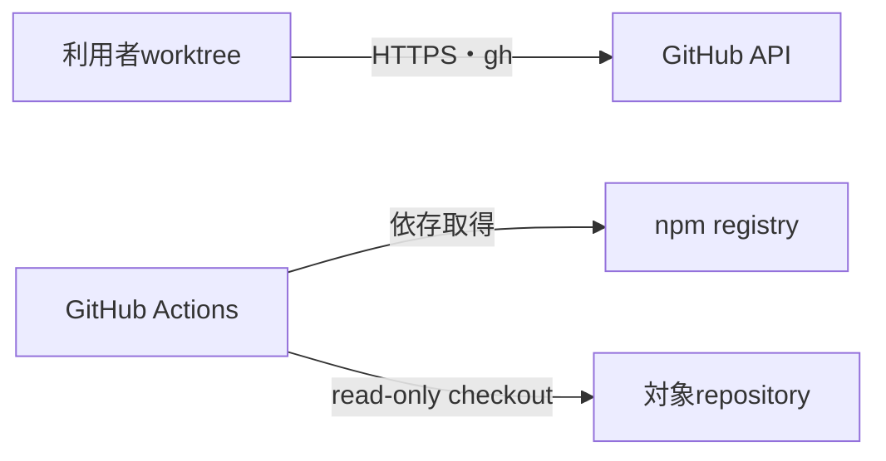

# 実行基盤・ネットワーク境界

パッケージはNode.js 20以上のローカル実行環境またはGitHub Actions上で動作する。常設サーバー、公開ポート、独自ネットワーク基盤を持たない。

| 通信 | 送信元 | 宛先 | 目的 | 認証 | 既定動作 |
|---|---|---|---|---|---|
| GitHub API | 許可されたCLI実行環境 | 完全一致したrepository | Issue、PR、保護状態 | `gh`認証 | 不明・不一致なら拒否 |
| npm依存取得 | CI・開発環境 | npm registry | 開発依存の導入 | 公開取得 | lockfileを使用 |

テストは実GitHubリモートへ書き込まず、一時Git repositoryと模擬アダプターだけを使用する。
