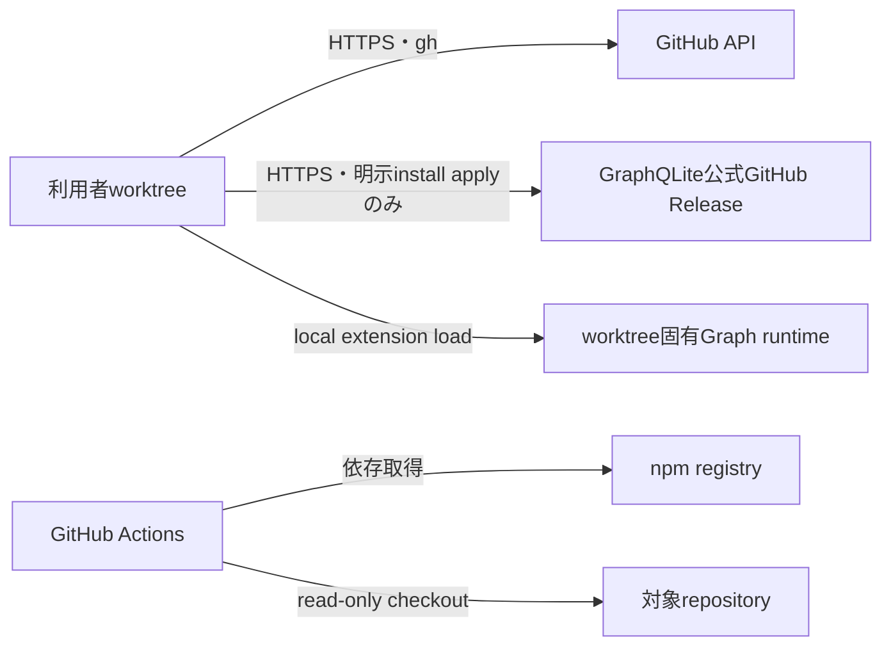

# 実行基盤・ネットワーク境界

パッケージの非Graph CLIはNode.js 20以上、Graph subcommandはNode.js 22.13.0以上のローカル実行環境またはGitHub Actions上で動作する。常設サーバー、公開ポート、独自ネットワーク基盤を持たない。GraphQLiteは別serviceではなく、各worktree内で`node:sqlite`が読み込む固定SQLite extensionである。

| 通信 | 送信元 | 宛先 | 目的 | 認証 | 既定動作 |
|---|---|---|---|---|---|
| GitHub API | 許可されたCLI実行環境 | 完全一致したrepository | Issue、PR、保護状態 | `gh`認証 | 不明・不一致なら拒否 |
| npm依存取得 | CI・開発環境 | npm registry | 開発依存の導入 | 公開取得 | lockfileを使用 |
| GraphQLite asset取得 | 明示された利用者worktree | `colliery-io/graphqlite` v0.6.1公式GitHub Release | platform固定assetの導入 | 公開取得 | `--apply`のみ通信し、URL・size・SHA-256不一致は配置せず拒否 |

投影再構築と探索はlocalで完結し、server、port、shared databaseを作らない。テストは実GitHubリモートへ書き込まず、一時Git repository、固定extension fixture、模擬アダプターだけを使用する。
