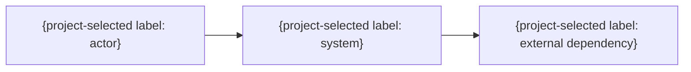

# システムコンテキスト

状態: {提案 / 承認済み}（確認者: {役割}、根拠: {Issue・PR等}）

> 任意の詳細雛形。既存の仕様・書式・ID・設計を優先する。必要な項目だけ使う。例の構成・値は確定仕様ではない。

```mermaid
flowchart LR
  actor_node["{project-selected label: actor}"] --> system_node["{project-selected label: system}"]
  system_node --> external_node["{project-selected label: external dependency}"]
```

| 接続先 | 目的 | 契約（API・IF ID） | データ（DATA ID） | 信頼区分 | 障害時の縮退 |
|---|---|---|---|---|---|
| {名称} | {目的} | {API-... / IF-...} | {DATA-...} | 信頼しない / 条件付き | {縮退} |

外部の依存先ごとの障害時の縮退は、この表を正本とする。
